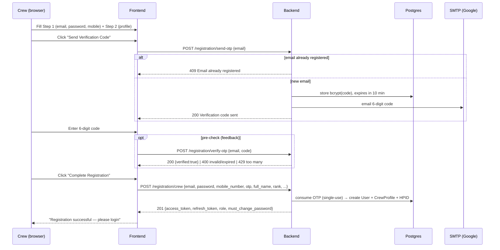
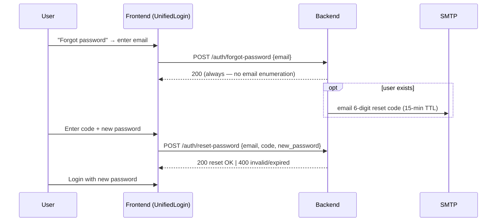
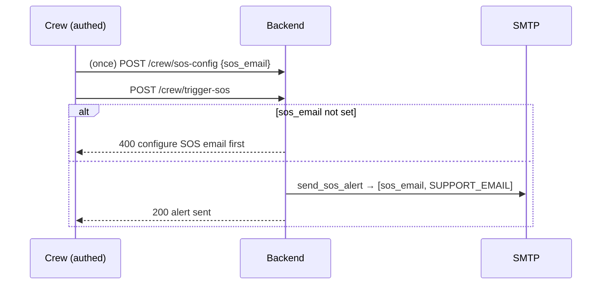

# HeyPorts — Feature Flows

Step-by-step flows for the features added/changed this cycle, with endpoints,
request/response shapes, and edge cases. Companion to
`HEYPORTS_TODOS_AND_DECISIONS.md` (design rationale + env vars).

All backend paths are under `/api/v1`. All email steps require `SMTP_*` to be
configured — otherwise the message is only logged and the flow can't complete
in prod (see §6).

---

## 1. Registration with email OTP ("block at signup") — NEW

New crew accounts must verify a code emailed to their address **before** the
account is created. The user row only exists once the code checks out.

### Endpoints

| Step | Endpoint | Body | Success | Errors |
|------|----------|------|---------|--------|
| Send code | `POST /registration/send-otp` | `{email}` | `200 {message}` | `409` email already registered |
| Pre-check (optional) | `POST /registration/verify-otp` | `{email, code}` | `200 {verified:true}` | `400` invalid/expired · `429` too many attempts |
| Create account | `POST /registration/crew` | `{email, password(≥6), mobile_number, otp(6), full_name, rank, nationality, passport_number?, date_of_birth?}` | `201 AuthOut` | `400` invalid/expired code · `409` email/mobile taken · `422` missing/!=6-digit otp |

### Rules
- Code: **6-digit, bcrypt-hashed, 10-min TTL, 5-attempt cap, single-use.**
- `send-otp` invalidates any prior code for that email.
- `verify-otp` is **non-consuming** (UI feedback only); `POST /crew` is the
  authoritative single-use check (`_consume_valid_otp`) and deletes the code.
- Storage: new `email_verifications` table (auto-created; no `users` migration).
- Resilience: the account commits **before** crew-manifest sync; a manifest-sync
  failure `rollback()`s and no longer 500s a successful signup.
- Scope: **crew only** today. Agent/aggregator signup is not yet OTP-gated.

### Frontend
`CrewRegistrationStep2.tsx` — two-phase submit: **"Send Verification Code"** →
reveals 6-digit field + **Resend** → **"Complete Registration"** (sends `otp`).

---

## 2. Forgot / reset password

| Step | Endpoint | Body | Success | Errors |
|------|----------|------|---------|--------|
| Request code | `POST /auth/forgot-password` | `{email}` | `200` (always) | — |
| Reset | `POST /auth/reset-password` | `{email, code, new_password(≥8)}` | `200` | `400` invalid/expired code |

Rules: hashed 6-digit code, **15-min TTL, single-use**, prior codes invalidated
on each request; forgot-password always returns `200` (no enumeration).

---

## 3. SOS alert → ship email

Alert goes to the crew's configured **ship `sos_email`** plus HeyPorts support
(`SUPPORT_EMAIL`), with crew name/vessel/port/lat-lng + a maps link.
Admins can review events via `GET /sos/{id}/timeline` (admin-gated).

---

## 4. Contact-us mail flow
`POST /contact` → background task emails the submission to `SUPPORT_EMAIL`
(reply-to = sender) + an acknowledgement. Best-effort; never blocks the response.

---

## 5. Bill upload & pay-online
1. `POST /crew/expense-bills` (multipart: receipt image/PDF ≤10 MB + merchant/
   bill_number/amount_pre_tax/amount_post_tax/date, optional `shore_pass_id` or
   `cab_booking_id`) → stored to **DigitalOcean Spaces** (`expense_bills/<key>`),
   local-disk fallback in dev. `GET`/`DELETE` are crew-scoped.
   - **Trip link:** `GET /crew/expense-bills/linkable-trips` lists the crew's
     active shore passes / cab bookings plus those ended **within 24 h**; the
     upload form offers them in a "Link to trip" picker. Server re-validates
     ownership + the 24 h window (400 if the trip ended earlier).
   - **Amount visibility:** crew responses show the **post-tax** (paid) amount;
     `GET /superadmin/expense-bills` (superadmin only) lists all bills with the
     **pre-tax** amount, crew name, bill no. and trip label → SuperAdmin
     "Expense Bills" screen.
2. Pay online (Razorpay): `POST /crew/payments/order` → checkout →
   `POST /crew/payments/verify` (HMAC-SHA256) → `paid`. **Mock mode** when
   `RAZORPAY_*` unset (order `order_mock_…`, empty `key_id`, auto-confirm).
3. **Auto-extract:** "Extract details" (shown once a file is picked) →
   `POST /crew/expense-bills/extract` (multipart image, crew-gated) → Claude
   Haiku 4.5 vision returns `{merchant, bill_number, amount, amount_pre_tax,
   amount_post_tax, currency, bill_date, confidence, enabled}` → the form
   pre-fills (paid amount + bill no. visible; pre-tax carried for admin
   reporting); crew reviews and confirms before saving. Nothing is persisted by
   `/extract`. `ANTHROPIC_API_KEY` unset → `enabled:false`, manual entry.

---

## 6. Config & fallbacks (applies to every email/storage step above)

| Service | Configured via | When unset (dev fallback) |
|---------|----------------|---------------------------|
| Email (OTP, reset, SOS, contact) | `SMTP_HOST/PORT/USER/PASSWORD/FROM`, `SUPPORT_EMAIL` | Logged only — **not sent** (OTP/reset can't complete in prod) |
| Storage (bill receipts) | `SPACES_KEY/SECRET/BUCKET/REGION` (`SPACES_ENDPOINT` = region host only) | Local `./uploads` (ephemeral on App Platform) |
| Payments | `RAZORPAY_KEY_ID/SECRET` | Mock order + auto-verify |
| Bill extraction (planned) | `ANTHROPIC_API_KEY` | Mock empty fields |

Prod values are set on the **DigitalOcean App Platform** env (backend
component); `VITE_API_BASE_URL` on the frontend component. `.env` is not deployed.
